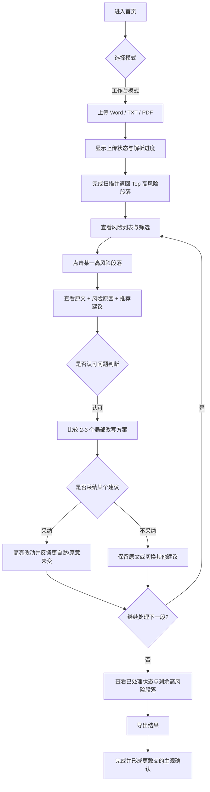
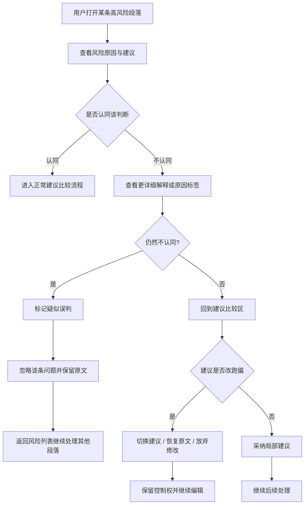
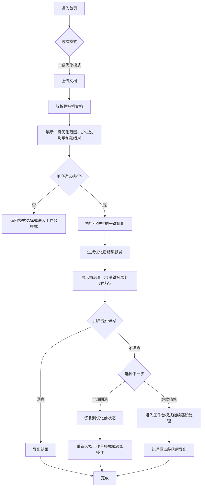

---
stepsCompleted:
  - 1
  - 2
  - 3
  - 4
  - 5
  - 6
  - 7
  - 8
  - 9
  - 10
  - 11
  - 12
  - 13
  - 14
lastStep: 14
inputDocuments:
  - C:\codex_workplace\AI降重工具\_bmad-output\planning-artifacts\prd.md
  - C:\codex_workplace\AI降重工具\_bmad-output\planning-artifacts\product-brief-AI降重工具-2026-03-20.md
  - C:\codex_workplace\AI降重工具\_bmad-output\planning-artifacts\research\market-多格式文档写作质量诊断与编辑工作台-research-2026-03-20.md
  - C:\codex_workplace\AI降重工具\_bmad-output\brainstorming\brainstorming-session-2026-03-20-151215.md
---

# UX Design Specification AI降重工具

**Author:** Valentin
**Date:** 2026-03-21

---

<!-- UX design content will be appended sequentially through collaborative workflow steps -->

## Executive Summary

### Project Vision

AI降重工具是一个桌面优先的多格式长文档写作质量诊断与后编辑工作台，目标不是规避检测机制，而是帮助用户快速识别并修复文章中“模板化、机械化、缺少作者感”的表达，让内容在正式提交前更像真实作者写出来的版本。产品的核心承诺是先找出最值得改的部分，再提供可解释、可选择、可回退的局部优化路径，让用户在高压交付场景下更敢交，也更可控。

### Target Users

主用户是毕业论文提交前 48 小时内进行定稿冲刺的大学生，常处理 2 万字到 10 万字以上的长文档，使用桌面浏览器完成上传、诊断、局部修改和导出。第二用户是文字工作者、编辑等需要处理长文稿件的人群，他们同样关心表达是否过于模板化，以及修改过程是否足够高效、可控。

### Key Design Challenges

- 需要在超长文档中快速建立信任，让用户相信系统识别出的高风险段落确实值得优先处理。
- 需要平衡“一键优化”的效率与“用户可控”的安全感，避免产品被感知为黑箱重写工具。
- 需要在临近截止时间的高压场景下减少认知负担，防止用户被大量问题段落和改写建议淹没。
- 需要处理 Word、TXT 与 PDF 在读取、定位、修改、导出上的能力差异，尤其是 PDF 在 MVP 中仅支持读取和扫描。

### Design Opportunities

- 将首屏设计成“风险指挥台”，直接展示 Top 高风险段落、风险原因和下一步操作，而不是通用空白编辑器。
- 用清晰具体的“为什么这里像 AI/像模板”的解释增强用户的理解感、控制感和信任感。
- 通过局部替换候选、原文对比、接受/拒绝/回退等机制，强化“不是整篇重写，而是最后一公里精修”的产品心智。

## Core User Experience

### Defining Experience

AI降重工具的核心体验不是整篇重写，而是帮助用户在高压交付前快速完成“发现高风险段落、理解风险原因、选择局部改写、保留控制权”的闭环。用户最常执行的动作应当是从风险清单进入具体段落，对比 2-3 个改写建议，选择最合适的一版并立即确认结果是否更自然、更像真实作者表达。产品的核心价值应在这个局部精修循环中被反复兑现。

### Platform Strategy

产品采用桌面优先的 SPA Web 形态，主要面向 Chrome 和 Edge 浏览器，交互以鼠标和键盘为主。MVP 聚焦正式写作和长文编辑场景，不做实时协作，也不以移动端为优先设计对象。文件能力上优先支持 Word、TXT 的读取与导出，PDF 在 MVP 中主要承担读取和扫描职责，不承诺复杂版式下的精确回写。当前体验默认在线优先，不将离线能力作为 MVP 前提。

### Effortless Interactions

- 上传长文档后快速进入扫描状态，并清晰看到进度与结果范围。
- 从 Top 高风险段落列表一键跳转到对应内容，而不是让用户自行查找。
- 直接看到“为什么这里像模板化表达”的解释，而不是只给抽象分数。
- 在局部范围内比较 2-3 个改写建议，并低成本接受、拒绝或回退。
- 在完成关键修改后顺畅导出结果，避免用户反复整理成品。

### Critical Success Moments

产品的第一个成败时刻，是用户在首屏看到风险清单时立刻感觉“终于有人告诉我先改哪里”。第二个关键时刻，是用户接受第一次局部改写后，明显感到表达更自然、原意没有跑偏，因此建立信任。第三个关键时刻，是用户在工作台或一键模式完成处理后，认为结果足够可控，因此更敢交。相反，如果风险判断显得随意、建议像黑箱重写、或用户无法轻松回退，体验信任会快速崩塌。

### Experience Principles

- 先指出最该改的地方，再谈全面优化。
- 先解释原因，再提供改写。
- 默认支持局部可控编辑，而不是强推整篇重写。
- 让用户始终知道自己改了什么、为什么改、还能怎么撤回。
- 优先服务桌面端长文高压处理效率，而不是追求泛场景覆盖。

## Desired Emotional Response

### Primary Emotional Goals

AI降重工具的首要情绪目标，是让用户在高压提交前从慌乱、不确定和不敢交，转向更稳、更有把握、更加敢交。第二目标是让用户感到自己被托住、被理解，而不是被系统审判；产品应传递一种“我知道你现在时间紧、压力大，我先帮你把最该改的地方指出来”的支持感。第三目标是强化掌控感，让用户始终觉得这仍然是自己的文章，系统是在辅助修改，而不是接管写作。最终，用户在完成关键修改后应获得明显的如释重负感。

### Emotional Journey Mapping

用户刚进入产品时，通常处于焦虑、时间紧迫、对结果不确定的状态。上传并完成扫描后，情绪应迅速从“乱”和“慌”转为“清楚知道先改哪里”的聚焦感。进入局部修改阶段时，用户应感到被支持而不是被替代，能理解为什么要改、有哪些可选改法、以及自己保留最终决定权。完成主要修改并导出后，用户应感到结果更稳、风险更低、自己更敢提交。再次回访时，用户应形成稳定预期：这是一个能在关键时刻托住我、而不是让我更乱的工具。

### Micro-Emotions

对本产品最关键的微情绪包括：从混乱到清晰，从焦虑到冷静，从怀疑到信任，从被审判到被理解，从被动接受到主动掌控，从勉强提交到有把握地提交。相比“惊艳感”，更重要的是一种持续累积的可靠感和确认感。用户不一定需要被娱乐，但必须持续感觉到系统判断有依据、建议有边界、结果可回退，而且文章仍然保有自己的作者感。

### Design Implications

如果要让用户感到安心和被托住，首屏就必须直接给出高风险段落、风险原因和建议动作，而不是先让用户面对复杂编辑器或抽象评分。如果要让用户感到被理解而非被审判，文案与标签体系必须采用中性、克制、非指责性的表达，例如“表达趋同”“作者感偏弱”“论证较空泛”，避免使用羞辱性或定罪式措辞。如果要让用户感到掌控，工作流必须默认支持逐段接受、拒绝、回退、切换建议，并让所有修改可追踪。一键优化模式也必须保留结果预览、变更可见和撤回能力，否则会直接破坏产品的信任基础和情绪目标。

### Emotional Design Principles

- 先让用户稳下来，再帮助用户提效。
- 先建立“我被理解了”的感受，再建立“这个工具很强”的感受。
- 每一步都要强化“这是你在修改自己的文章”，而不是“系统在替你重写文章”。
- 采用清晰、克制、非指责性的语言，避免制造羞耻感或被审判感。
- 所有高价值交互都应服务于一个结果：让用户在最短路径上获得“我现在更敢交了”的主观确认。

## UX Pattern Analysis & Inspiration

### Inspiring Products Analysis

当前最相关的两个参考方向分别是笔灵AI与 SpeedAI。笔灵AI的可借鉴点在于其“场景先行”的任务组织方式：用户不必先理解复杂系统结构，而是先进入一个明确任务，如润色、改写、压缩或诊断，然后立即开始上传和处理。这种方式降低了首次使用成本，也符合高压场景下用户“我现在就要解决问题”的行为模式。对 AI降重工具 来说，这启发我们在入口层应避免抽象导航，而要让用户直接进入“工作台模式”或“一键优化模式”这样的任务入口。SpeedAI的可借鉴点在于其高度集中的结果导向表达和文档级处理心智。它更强调从文件输入到结果产出的完整链路，这对论文冲刺类用户有很强吸引力。对本产品而言，可借鉴的是“用户上传长文档后立即进入一个明确的扫描与处理流程”，而不是让用户面对空白编辑器自行探索。两者共同说明，目标用户更偏好“任务驱动、立即见效、路径简短”的体验，而不是功能学习成本高的通用编辑平台。

### Transferable UX Patterns

可迁移到本产品的模式包括：第一，任务化入口模式。用户进入后不应先看到复杂工具导航，而应直接看到“工作台模式”与“一键优化模式”两个清晰选择。第二，上传即开始的处理链路。上传文档后，系统应尽快进入扫描状态，并明确展示当前处理进度、文档范围和预计输出，而不是停留在等待用户进一步配置。第三，结果优先的信息结构。相比把全文编辑器放在最前面，更适合先展示 Top 高风险段落、原因解释和建议动作，让用户迅速进入最有价值的修改点。第四，局部处理与整篇处理并存。参考工具展示了用户既需要快速整体处理，也需要具体到段落的局部调整，因此本产品保留“一键优化”和“工作台局部精修”双路径是合理的。第五，低认知负担的单任务界面。每个关键页面都应围绕一个明确目标组织，而不是在同一屏里塞入过多工具和次要信息。

### Anti-Patterns to Avoid

需要避免的反模式包括：将产品做成模板和功能的堆叠广场，导致用户在高压场景下不知道先点哪里。过度依赖“黑箱式一键处理”叙事，让用户看不到为什么改、改了什么、还能不能撤回。将核心价值过度包装为“绕过检测”或“降AI率”本身，削弱产品作为写作质量诊断与后编辑工作台的可信度。在首页优先展示营销式承诺，而不是优先展示用户真正关心的风险定位与修改路径。使用过于审判式、刺激性的标签语言，使用户产生被评判或被羞辱感。

### Design Inspiration Strategy

本产品应采纳“任务入口清晰、上传即处理、结果优先展示”的设计策略，以降低首次使用门槛并适配 deadline 场景。在模式借鉴上，应借鉴参考产品的强任务感和短路径，但必须改造成更可控的工作流：不是直接承诺神奇结果，而是让用户先看到高风险段落，再理解原因，再选择建议，再决定是否接受。在信息结构上，应弱化工具超市感，强化“风险指挥台”体验，让首页即体现产品独特价值。在品牌与交互表达上，应避免使用过度靠近规避检测的话术，而是坚持“降低模板感、增强作者感、提升提交信心”的产品语言。整体上，本产品不是要成为另一个泛 AI 写作工具，而是要成为长文正式提交前最后一公里的诊断与精修工作台。

## Design System Foundation

### 1.1 Design System Choice

AI降重工具采用“可主题化设计系统”作为设计基础。该方案不是完全自研组件体系，也不是直接套用现成视觉风格强烈的整套设计系统，而是在成熟、可访问、可复用的组件基础上，通过主题、设计 token 和局部定制组件来建立产品自己的工作台体验。这种方式最适合当前桌面优先 SPA、单人开发、MVP 需要快速落地的现实约束。

### Rationale for Selection

选择可主题化设计系统的原因主要有四点。第一，它在开发速度与品牌差异化之间取得了最合适的平衡，既不会像纯自定义系统那样前期投入过高，也不会像强风格现成系统那样让产品看起来缺乏辨识度。第二，它更适合本产品的核心界面形态。AI降重工具不是纯营销页，而是一个需要承载风险列表、段落对比、局部建议、状态反馈和导出操作的桌面工作台，因此需要稳定可靠的基础组件，同时保留对信息密度、层级结构和交互细节的定制空间。第三，它更适合单人团队长期维护。通过复用成熟组件和可访问性能力，可以把有限精力集中在真正决定产品差异的体验层，例如风险指挥台、建议对比、局部接受与回退，而不是消耗在所有基础控件从零构建上。第四，它与项目当前约束一致。产品明确要求桌面优先、Chrome/Edge 为主、符合 WCAG 2.1 AA，采用可主题化系统可以更稳定地满足一致性、可维护性和可访问性要求。

### Implementation Approach

在实现方式上，设计系统应采用“基础组件层 + 主题层 + 产品特化组件层”的三层结构。基础组件层负责按钮、输入框、下拉框、弹层、标签、表格、分栏、提示反馈等通用控件，优先依赖成熟、可访问的组件能力。主题层负责颜色、字体、间距、圆角、边框、阴影、状态色、密度等设计 token，确保整个平台形成统一、可迭代的视觉规则。产品特化组件层则围绕本产品核心工作流构建，如高风险段落卡片、风险解释面板、改写建议比较器、修改轨迹提示、导出状态模块等。这些部分应成为真正体现产品差异化的重点。

### Customization Strategy

定制策略上，AI降重工具不应追求“看起来像另一个通用后台系统”，而应建立一种更像高压写作工作台的界面气质：稳定、清晰、可信、不过度装饰。视觉上应优先强化信息层级与状态辨识，而不是追求营销化或娱乐化表达。组件上应尽量复用成熟基础控件，但在以下区域进行重点定制：首屏风险指挥台、段落风险标签体系、原文与建议对比区、一键优化结果审查区、修改采纳与回退反馈。整体策略是：通用能力标准化，核心价值界面产品化，品牌感通过主题和关键模块塑造，而不是通过大面积重做所有基础组件来实现。

## 2. Core User Experience

### 2.1 Defining Experience

AI降重工具的定义性体验是：系统先指出最该修改的高风险段落，解释为什么这些段落读起来像模板化表达，再提供 2-3 个局部改写建议，让用户在可对比、可撤回的前提下快速选出一版更自然、但不改变原意的表达。如果这个体验做对了，用户会用一句非常具体的话描述产品：“它先告诉我最该改哪几段，解释为什么，然后让我在局部改写里选一版，马上就更敢交。”这不是整篇重写体验，而是高压交付场景下的风险优先、局部可控精修体验。

### 2.2 User Mental Model

用户当前解决问题的方式通常是自己逐句改、反复换 prompt、换其他润色工具，或者找真人润色。因此他们带入产品的心理模型并不是“请系统替我写”，而是“请先告诉我哪里最危险，再帮我把这些地方修得更像人写的，但不要把意思改掉”。他们期待的不是聊天式生成，而更像一种“文档诊断 + 局部编辑建议 + 人工确认”的工作流。用户最容易产生困惑或不信任的地方包括：风险判断依据不清楚、建议改写看起来跑偏、修改后看不出原意是否保持、系统替换过多且难以撤回。

### 2.3 Success Criteria

核心体验是否成功，取决于以下标准：
- 用户在看到 Top 风险段落列表后，立刻理解“先改哪里最值”。
- 用户阅读第一条解释时，觉得判断有依据，而不是随意打分。
- 用户采纳第一条建议后，立刻感觉表达更自然了，同时确认原意没有被改坏。
- 用户能明确看到改了什么，并且始终可以拒绝、切换建议或回退。
- 整个过程足够快，不让用户在长文档场景中等待和犹豫过久。

### 2.4 Novel UX Patterns

这个产品不需要发明全新的交互范式，而是要把几个用户熟悉的模式组合得更贴近问题本身。应采用的成熟模式包括：文档上传、任务模式选择、问题列表、定位跳转、原文与建议对比、接受/拒绝/回退、导出结果。本产品的独特点不在于“新奇交互”，而在于把这些成熟模式按“风险优先、解释优先、局部可控”的顺序重新编排。其中最有差异化的模式是：不是先编辑全文，而是先进入风险指挥台；不是先给改写，而是先解释为什么像模板；不是默认整篇替换，而是默认局部比较和人工确认。

### 2.5 Experience Mechanics

**1. Initiation**  
用户通过首页进入“工作台模式”或“一键优化模式”，上传 Word、TXT 或 PDF 文件后立即进入扫描流程。系统应尽快返回文档概况、扫描进度和 Top 风险段落列表。

**2. Interaction**  
用户从风险列表中点击某一段，进入该段的诊断与改写面板。系统展示原文、风险原因、1 个推荐建议和 2-3 个可选改写方案。用户可以逐一比较、切换、采纳、忽略或标记误判。

**3. Feedback**  
每次采纳建议后，系统必须立即反馈两个核心信号：表达是否更自然，以及原意是否保持稳定。反馈方式应结合修改前后对比、改动高亮和清晰状态提示，而不是只给抽象评分。若用户不满意，应能立即撤回。

**4. Completion**  
当用户完成关键段落处理后，系统应明确告诉用户哪些风险已处理、还有哪些高优先级问题待处理，并提供导出结果。用户完成时应感到文稿更稳、更像自己写的，也更敢提交。

## Visual Design Foundation

### Color System

AI降重工具的颜色系统应围绕“冷静可信、清晰判断、降低焦虑”建立，而不是围绕“炫技”或“强 AI 感”建立。主基调建议采用浅色工作台方案，以高可读性的中性色作为大面积背景，再用克制的蓝灰色系作为主品牌色，辅以低饱和青色作为辅助强调色。整体建议如下：
- 主背景：偏暖或中性的浅灰白，用于降低长时间阅读疲劳。
- 主品牌色：深蓝灰或墨蓝，用于主按钮、关键导航、核心状态确认，传达稳定与可信。
- 辅助强调色：低饱和青绿色，用于局部聚焦、选中状态和轻量积极反馈。
- 警示色：克制的琥珀色或橙棕色，用于高风险提醒，而非刺眼纯黄。
- 错误色：偏砖红或深红，用于明确失败、导出错误、解析异常等场景。
- 成功色：偏墨绿而非高饱和荧光绿，用于表示处理完成、导出成功、修改已采纳。

语义色应服务于“判断与处理”而不是“情绪刺激”。尤其在风险标记上，应通过层级清楚的色阶和标签体系区分“高风险”“中风险”“已处理”“待确认”“疑似误判”，而不是依赖过度强烈的彩色块制造压迫感。

### Typography System

排版系统应以长文阅读与工作台操作并重为原则。因为用户既要读风险解释、原文段落和改写建议，也要进行频繁的判断和操作，所以字体策略应优先考虑清晰、稳定和连续阅读体验。建议采用现代无衬线中文界面字体作为主字体，用于导航、按钮、标签、表格、说明文本和正文阅读；英文与数字可配合同体系西文字体，保证文档统计、分数、状态、快捷键提示的整洁度。

排版层级建议明确而克制：
- 页面级标题用于模式切换和主任务区
- 区块级标题用于风险列表、原因分析、建议比较、导出结果等模块
- 正文级文本用于原文、解释、建议文本
- 辅助级文本用于状态说明、时间、文件信息、提示说明

正文排版不应过小，必须支持高压场景下的快速扫读。长段落区域需要更高的行高和更稳定的字重控制，以避免建议内容和原文对比时产生阅读噪声。

### Spacing & Layout Foundation

整体布局应采用桌面优先的中等密度工作台逻辑，重点是“看得清、扫得快、切换少”。不建议采用极度紧凑的后台布局，也不建议使用大量留白的展示型布局。建议以 8px 为基础 spacing unit，向上扩展为 16 / 24 / 32 的主要间距节奏。这样既适合构建清晰的模块边界，也便于在风险列表、对比面板、状态区和操作区之间建立稳定层级。

布局结构上建议采用多区块工作台形式：
- 顶部保留文件信息、模式状态、进度、导出操作等全局内容
- 左侧或左上区域承担风险列表与过滤
- 主内容区承担原文、风险解释与建议对比
- 辅助区域承担状态反馈、处理结果、修改记录或回退入口

布局原则应服务于“少跳转、少迷路、少上下文丢失”。用户在查看某段建议时，不应失去对全文风险状态和当前处理进度的感知。

### Accessibility Considerations

视觉基础必须满足 WCAG 2.1 AA，尤其考虑桌面长时间使用和高压修改场景。关键要求包括：
- 正文与背景、按钮与背景、标签与背景保持足够对比度
- 颜色不能作为唯一状态信号，所有风险、成功、错误、已处理状态都应配合文字或图标
- 交互控件需要有清晰 focus 状态，支持键盘导航
- 正文、解释文本、建议对比文本需要保持可读字号和行高
- 风险标签、提示信息、悬浮说明不应依赖极小字体
- 重要操作如采纳、回退、导出必须具有明确可识别的反馈

整体上，视觉系统要帮助用户在高压下更稳，而不是靠颜色、动画或密集信息进一步制造紧张感。

## Design Direction Decision

### Design Directions Explored

本轮共探索了 6 个设计方向，分别覆盖风险指挥台、编辑工作台、证据审阅台、流程引导台、高密度分析台和单段专注面板等不同结构。它们都基于同一视觉基础展开，即冷静可信的浅色工作台、蓝灰主色、中等密度、桌面优先和可解释的状态体系。探索重点不是追求纯视觉差异，而是比较哪种布局最能支撑“先定位风险、再解释原因、再局部改写、最后更敢交”的核心体验。

### Chosen Direction

当前建议采用“D1 作为主方向，融合 D2 与 D3 的关键要素”的组合方案。其中，D1 Calm Command Center 作为主工作台骨架，负责承载首页和核心作业界面的信息层级：先展示高风险段落、再进入处理。D2 Editorial Split Desk 提供段落级精修体验的结构参考，用于原文、原因、候选建议和操作按钮的局部对比区。D3 Evidence Ledger 提供可信度表达方式，用于风险原因、处理状态、修改记录和可追踪反馈的设计语言。整体上，这不是三种风格的拼接，而是以 D1 为主架构、D2 为局部交互、D3 为可信表达的统一工作台方向。

### Design Rationale

选择这一组合的原因有四点。第一，它最符合产品的核心承诺：用户进入后应先看到“先改哪里最值”，而不是先面对全文编辑器。第二，它兼顾了“更敢交”和“更可控”两个价值点。D1 负责建立清晰的风险优先感，D2 负责强化局部改写时的作者掌控感，D3 负责让判断过程更可信、可解释。第三，它与当前确认的情绪目标一致，即让用户从慌乱转向稳定，从被动接受转向主动掌控，而不是被黑箱重写。第四，这种组合在实现上更适合单人开发和 MVP 迭代：主框架清晰，局部模块可分步构建，不需要一次性完成高度复杂的全新界面系统。

### Implementation Approach

实现上应先构建 D1 风格的主工作台：顶部为文件状态和导出操作，左侧为风险列表与筛选，中间为当前段落内容与原因解释，右侧为建议、采纳状态与回退入口。在段落级交互中，引入 D2 的双栏或分区对比结构，使原文、解释和候选改写之间的阅读路径更自然。在状态和反馈语言上，引入 D3 的证据链表达，例如清晰区分风险等级、处理状态、误判标记、修改记录和可撤回操作。后续若需要增加首次使用引导，可局部吸收 D4 的流程感，但不应替代主工作台结构。D6 更适合作为二级专注视图，而不是主首页方向。

## User Journey Flows

### Journey 1: 工作台模式主成功路径

这条旅程对应主用户在毕业论文定稿前 48 小时内进入产品、上传文档、查看 Top 风险段落、逐段完成局部精修并导出的完整闭环。它是 MVP 的核心用户流，决定产品能否兑现“更敢交 + 更可控”的基本承诺。该旅程的关键不是“改得多快”，而是让用户在最短时间内确认：系统找对了地方、解释说得通、建议没有改跑偏。

### Journey 2: 结果不完全信服时的恢复路径

这条旅程对应用户对某些风险判断或建议改写不完全认同的情况。它不是异常边缘，而是建立信任的关键路径之一。产品不需要永远判断正确，但必须在用户不同意时仍然给出清楚的解释、保留控制权，并允许快速恢复到安全状态。只要恢复路径清楚，用户就不会因为一次误判而彻底失去信任。

### Journey 3: 一键优化后的审查与继续精修路径

这条旅程对应高压场景下用户选择效率优先的路径。产品允许用户走一键优化，但不能把它做成黑箱终点。正确的一键路径不是“点一下直接结束”，而是“点一下先获得一版受护栏约束的结果，再决定接受、回退或继续局部精修”。这样才能同时满足效率需求与控制感需求。

### Journey Patterns

跨这三条旅程，可以提炼出几组应统一的模式：

- 任务入口模式统一：所有旅程都从“工作台模式 / 一键优化模式”开始，而不是从抽象工具导航开始。
- 风险优先模式统一：系统先返回 Top 风险段落或结果概况，而不是直接把用户扔进全文编辑器。
- 解释与建议紧邻：原因解释必须与原文、建议、状态反馈放在相邻区域，避免用户在多个页面间跳转。
- 控制权模式统一：无论是局部修改还是一键优化，用户都必须能切换建议、保留原文、撤回修改或返回上一步。
- 状态反馈统一：所有关键节点都要明确告诉用户当前在做什么、已经完成什么、下一步还能怎么做。

### Flow Optimization Principles

这些流程后续在详细交互设计中应遵循以下优化原则：

- 尽量缩短“上传文档”到“看到第一批高风险段落”的时间。
- 将“解释”做成高信息密度但低阅读负担的界面，而不是长篇说明。
- 每次关键操作后都提供明确反馈，尤其是“更自然了”和“原意没变”这两个核心信号。
- 不让用户在任何阶段失去返回、撤回或切换路径的能力。
- 将一键优化设计为效率分支，而不是信任黑箱。
- 让工作台模式和一键模式共享同一套状态语言和结果审查逻辑，避免产品像两个割裂工具。

## Component Strategy

### Design System Components

AI降重工具采用可主题化设计系统，因此基础组件应尽量复用成熟能力，而不是重复造轮子。可直接继承或轻度主题化的组件包括：

- Button：主操作、次操作、危险操作、轻量操作
- Input / Textarea：文件命名、筛选、备注、问题反馈
- Select / Dropdown / Menu：筛选维度、排序、模式切换
- Tabs / Segmented Control：工作台模式、一键优化模式、结果视图切换
- Dialog / Drawer / Popover：确认、警告、补充解释、导出提示
- Tooltip / Helper Text：术语解释、状态提示、规则说明
- Badge / Tag / Status Pill：风险等级、处理状态、误判标记
- Progress / Spinner / Skeleton：上传、解析、扫描、导出过程反馈
- Table / List primitives：风险列表、任务列表、内部状态展示
- Toast / Inline Alert：保存成功、导出完成、回退成功、失败提示
- Checkbox / Radio / Switch：一键优化护栏、筛选项、偏好项
- Pagination / Virtual list support：长文档风险列表与大结果集承载

这些基础组件的目标是提供一致、可访问、低维护的底层能力。真正体现产品差异的部分，不应放在按钮和输入框，而应放在风险识别、解释、建议比较和结果控制这些核心组件上。

### Custom Components

### 模式入口卡（Mode Entry Card）

**Purpose:** 帮用户在首页快速进入“工作台模式”或“一键优化模式”。  
**Usage:** 首页首屏、重新开始流程时。  
**Anatomy:** 模式标题、适用场景说明、核心收益、风险提示、主按钮。  
**States:** 默认、悬浮、选中、禁用。  
**Variants:** 工作台模式卡、一键优化模式卡。  
**Accessibility:** 卡片整体可聚焦，支持键盘选择和 Enter 触发。  
**Interaction Behavior:** 点击后进入对应流程，并保留模式上下文。

### 高风险段落卡（Risk Paragraph Card）

**Purpose:** 在风险列表中表达“哪一段最值得先处理”。  
**Usage:** 主工作台左侧风险列表、扫描结果总览。  
**Anatomy:** 段落摘要、风险标签、原因短句、风险强度、处理状态、跳转入口。  
**States:** 未处理、处理中、已处理、已忽略、疑似误判。  
**Variants:** 紧凑列表版、详细版。  
**Accessibility:** 支持键盘上下导航、状态朗读、标签文本不依赖颜色单独表达。  
**Interaction Behavior:** 点击后定位到对应段落并加载诊断面板。

### 段落诊断面板（Segment Diagnosis Panel）

**Purpose:** 承载当前段落的原文、问题解释和判断依据。  
**Usage:** 主工作台主内容区。  
**Anatomy:** 原文区、原因解释区、问题标签、建议强弱说明、可选展开说明。  
**States:** 加载中、已加载、解释展开、解释收起、异常状态。  
**Variants:** 标准版、PDF 只读版。  
**Accessibility:** 原文与解释区支持标题结构、朗读顺序清晰、键盘切换区域。  
**Interaction Behavior:** 与风险卡联动切换；支持展开更详细解释但默认保持紧凑。

### 改写建议比较器（Rewrite Option Comparator）

**Purpose:** 让用户比较 2-3 个局部改写建议，并判断哪一版更自然且未改跑偏。  
**Usage:** 段落诊断面板右侧或下方。  
**Anatomy:** 推荐建议卡、备选建议卡、原文对照、差异高亮、采纳按钮、切换按钮。  
**States:** 默认、建议切换中、已采纳、已拒绝、回退后。  
**Variants:** 单列比较、双列并排比较。  
**Accessibility:** 每条建议可独立聚焦，差异不能只靠颜色表达，采纳操作有明确反馈。  
**Interaction Behavior:** 用户可切换建议、采纳、拒绝、回退，并立即看到改动结果。

### 修改决策条（Decision Action Bar）

**Purpose:** 给用户稳定、低摩擦的局部决策入口。  
**Usage:** 每条建议底部、段落处理完成后。  
**Anatomy:** 采纳、拒绝、恢复原文、标记误判、继续下一段。  
**States:** 默认、操作中、成功、失败、已回退。  
**Variants:** 局部版、一键结果审查版。  
**Accessibility:** 操作顺序固定、支持快捷键、危险动作需明确确认。  
**Interaction Behavior:** 所有决策都应留下可追踪状态，不做不可逆修改。

### 一键优化审查面板（Guardrailed Optimize Review）

**Purpose:** 承载一键优化后的结果预览、变化审查与后续分流。  
**Usage:** 一键优化完成后。  
**Anatomy:** 优化范围说明、护栏说明、前后对比摘要、关键变化列表、接受/回退/继续精修入口。  
**States:** 生成中、可审查、部分不满意、已回退、已确认。  
**Variants:** 总览版、重点段落版。  
**Accessibility:** 变化摘要需可文本化表达，支持键盘浏览重点变化。  
**Interaction Behavior:** 用户不能被迫直接接受结果，必须能回退或切入工作台继续处理。

### 处理状态轨道（Processing Status Rail）

**Purpose:** 在上传、解析、扫描、优化、导出过程中持续建立“系统在做什么”的信任。  
**Usage:** 顶部全局状态区。  
**Anatomy:** 当前阶段、完成节点、异常提示、预计下一步。  
**States:** 上传中、解析中、扫描中、优化中、导出中、失败、完成。  
**Variants:** 紧凑顶栏版、详细任务版。  
**Accessibility:** 状态更新可被读屏识别，失败信息有明确文本说明。  
**Interaction Behavior:** 与页面全局流程联动，不让用户陷入“到底卡在哪”的不确定感。

### Component Implementation Strategy

整体组件策略应遵循“三层结构”：

第一层是设计系统基础组件，负责一致性、无障碍与开发效率。  
第二层是组合型工作台组件，将基础组件封装成风险列表、状态条、建议卡、结果面板等业务组合。  
第三层是关键差异化组件，即真正决定产品价值的自定义模块：高风险段落卡、段落诊断面板、改写建议比较器、一键优化审查面板。

实现原则如下：

- 基础能力复用设计系统，不做重复开发。
- 所有自定义组件都必须使用统一 token，而不是各自定义样式。
- 所有关键状态都必须支持：默认、加载、空态、错误、成功、回退后。
- 所有关键交互都必须支持键盘操作和清晰 focus。
- 所有高价值组件都要围绕“解释先行、局部可控、结果可回退”展开，而不是围绕炫技展示展开。

### Implementation Roadmap

**Phase 1 - MVP 核心组件**
- 模式入口卡
- 高风险段落卡
- 段落诊断面板
- 改写建议比较器
- 修改决策条
- 处理状态轨道

**Phase 2 - 一键优化与恢复能力**
- 一键优化审查面板
- 变化摘要卡
- 回退确认组件
- 误判标记与忽略反馈组件

**Phase 3 - 增强与复用组件**
- 风险筛选与排序栏
- 批量处理辅助组件
- 导出总结面板
- 修改历史与状态摘要组件

优先级原则不是“哪个更好看先做哪个”，而是“哪个组件最直接支撑主旅程先做哪个”。因此，真正优先的不是营销组件，而是风险定位、解释、建议比较、决策和回退这几组工作台核心组件。

## UX Consistency Patterns

### Button Hierarchy

AI降重工具的按钮层级必须围绕“低风险决策”和“高频工作流”来设计，而不是沿用通用后台系统的随意主次关系。

**Primary Actions**  
用于当前页面唯一最重要的下一步，例如：
- 开始扫描
- 采纳当前建议
- 确认一键优化
- 导出结果

主按钮在同一视图中应尽量保持唯一，避免多个同权主操作并列，导致用户在高压场景下犹豫。

**Secondary Actions**  
用于辅助但常见的动作，例如：
- 切换建议
- 继续下一段
- 返回工作台
- 进入局部精修

**Tertiary / Quiet Actions**  
用于低风险、非主路径操作，例如：
- 展开更多解释
- 查看细节
- 复制文本
- 打开帮助说明

**Danger Actions**  
用于恢复、覆盖、删除、放弃等高风险操作，例如：
- 恢复原文
- 回退一键优化
- 放弃未保存修改

危险操作必须带有明确确认机制，且文案要直接表达后果，而不是用模糊的“确认/取消”。

**Pattern Rules**
- 同一区域只允许一个视觉最强主操作。
- “采纳建议”与“恢复原文”不能做成等权重样式。
- 一键优化后的“接受结果”与“回退结果”必须形成清晰区分，但都要可达。
- 所有关键按钮都要支持键盘 focus、Enter/Space 激活和清晰状态反馈。

### Feedback Patterns

本产品的反馈设计不应追求热闹，而应追求“用户知道发生了什么、为什么、接下来怎么办”。

**Success Feedback**  
用于：
- 建议采纳成功
- 回退成功
- 导出完成
- 扫描完成

成功反馈应短、明确、可验证，例如“已采纳此建议”“已恢复原文”“已完成导出”。

**Warning Feedback**  
用于：
- 建议可能改变原意
- PDF 定位可能不完全准确
- 一键优化范围较大
- 当前仍有高风险段落未处理

警告反馈应优先告诉用户风险是什么，不应只显示抽象图标或颜色。

**Error Feedback**  
用于：
- 上传失败
- 解析失败
- 导出失败
- 状态同步失败

错误反馈必须回答 3 个问题：
- 哪里失败了
- 当前数据是否安全
- 用户下一步能做什么

**Informational Feedback**  
用于：
- 护栏说明
- 解释为什么这段像模板
- 当前处理进度
- 筛选结果变化

**Pattern Rules**
- 反馈优先使用内联状态和局部提示，少依赖打断式弹窗。
- Toast 只用于轻量成功或不阻塞提醒，不用于承载复杂错误解释。
- 所有反馈都要尽量落在动作发生位置附近。
- 反馈文本必须避免审判式表达，保持中性、可解释、可操作。

### Form Patterns

本产品的表单不复杂，但上传、模式选择、筛选和确认节点非常关键，因此表单模式必须足够稳。

**Upload Form Pattern**
- 先选模式，再上传文件
- 明确支持格式、大小、处理边界
- 上传后立即进入处理状态，不要求用户填写多余配置

**Confirmation Form Pattern**  
用于一键优化前的护栏确认、回退确认、导出前确认：
- 必须说明动作范围
- 必须说明是否可撤回
- 必须把主要后果写在确认按钮附近

**Filter / Sort Pattern**  
用于风险列表中的风险等级、处理状态、问题类型筛选：
- 默认先给推荐筛选，不让用户一上来面对复杂组合
- 当前筛选条件应始终可见
- 支持一键清空筛选

**Validation Rules**
- 实时验证优先于提交后统一报错
- 报错文案直接指出问题和修复办法
- 不因单个字段报错阻塞无关浏览行为

### Navigation Patterns

导航模式应服务于“少跳转、少迷路、不断上下文”。

**Primary Navigation**  
产品级主导航应尽量轻量，MVP 中不做复杂多层信息架构。核心导航重点应放在：
- 首页 / 模式入口
- 当前任务工作台
- 导出结果或任务完成状态

**In-Workbench Navigation**  
工作台内部采用“全局状态 + 风险列表 + 当前段落处理区”的结构。用户应始终知道：
- 当前处理的是哪一段
- 全文还有多少高风险项
- 自己已经处理到哪里

**Movement Rules**
- 从风险列表进入段落处理时，不应丢失列表上下文
- 从一键优化结果进入局部精修时，不应重新开始
- 返回动作优先回到上一个稳定状态，而不是把用户送回首页

**Overlay Navigation**  
弹层、抽屉和侧边面板只用于补充信息或轻量确认，不承载完整主流程。

### Additional Patterns

#### Empty States

空态不能只写“暂无数据”，而应区分：
- 尚未上传文档
- 上传成功但尚未开始扫描
- 当前筛选下无结果
- 高风险段落已全部处理
- 当前无建议可展示

每种空态都应给出清晰下一步。

#### Loading States

加载态必须帮助用户建立信任，尤其在长文档场景下：
- 上传中
- 解析中
- 扫描中
- 一键优化中
- 导出中

应优先展示阶段性进度和当前步骤，而不是长期无反馈 spinner。

#### Search and Filtering Patterns

风险列表支持按问题类型、处理状态、风险等级筛选。搜索与筛选应默认服务于“快速找到最该处理的问题”，而不是做成复杂分析后台。

#### Compare and Rollback Patterns

凡是涉及建议采纳和一键优化，都必须统一支持：
- 修改前后可对照
- 当前版本可识别
- 回退入口清晰可见
- 回退后状态有明确反馈

#### Pattern Integration Rules
- 所有模式都必须与设计系统 token 保持一致
- 所有状态必须兼容桌面优先和键盘操作
- 所有关键规则必须优先服务“更敢交”和“更可控”

## Responsive Design & Accessibility

### Responsive Strategy

AI降重工具采用明确的桌面优先响应式策略。原因很直接：主场景是 2 万字到 10 万字以上长文档的风险定位、原文对照、建议比较与导出，这些核心任务天然更适合在桌面端完成。响应式设计的目标不是追求所有端完全等价，而是保证每个设备上都能完成“适合该设备的正确任务”。

**Desktop Strategy**  
桌面端是完整工作台主场景，应支持多面板并行工作：
- 顶部全局状态区承载文件、模式、进度、导出操作
- 左侧风险列表与筛选长期可见
- 主区域用于当前段落的原文、解释与建议比较
- 辅助区域用于处理状态、回退、修改记录或一键优化审查

大屏空间应优先用于减少切换和上下文丢失，而不是单纯放大留白。桌面端应保留完整信息层级和核心操作密度。

**Tablet Strategy**  
平板端不追求桌面端完全等价，但应支持中度任务处理。布局应从三栏收缩为双栏或分层切换结构：
- 风险列表与当前段落处理区优先保留
- 辅助状态区可折叠、抽屉化或标签切换
- 交互需要兼容触控，但不以复杂手势作为核心依赖

平板更适合查看结果、处理少量重点段落、继续上一任务，而不应作为复杂长时间精修的最佳环境。

**Mobile Strategy**  
移动端在 MVP 中不承担完整工作台职责。移动端优先支持：
- 查看任务状态
- 查看扫描结果摘要
- 查看 Top 风险段落概览
- 进行轻量确认动作
- 查看导出结果或回到桌面继续处理

移动端不应强行塞入完整多面板精修体验。对超长文档的原文对照、建议比较和批量处理，应明确引导用户在桌面端继续完成，以避免糟糕的伪全功能体验。

### Breakpoint Strategy

本产品采用桌面优先、任务能力分层的自定义断点策略，而不是机械套用通用内容网站断点。

- **Mobile:** `320px - 767px`
  - 以状态查看、结果摘要、轻量操作为主
  - 工作台核心多面板折叠为单列信息流
  - 不承诺完整长文精修体验

- **Tablet / Small Laptop:** `768px - 1199px`
  - 双栏或主次区域切换
  - 支持部分段落处理与重点建议审查
  - 将次级信息移入抽屉、标签页或折叠面板

- **Desktop:** `1200px - 1439px`
  - 默认完整工作台布局
  - 支持风险列表 + 当前段落处理 + 辅助状态区

- **Wide Desktop:** `1440px+`
  - 在不增加认知负担的前提下扩展阅读舒适度
  - 保持三栏结构，但允许更宽的对比区和更完整的状态信息

断点切换原则不是“能塞多少塞多少”，而是“在每个尺寸下保留最关键的任务闭环”。

### Accessibility Strategy

本产品明确以 **WCAG 2.1 AA** 作为可访问性基线。这不是附加项，而是正式写作与教育场景下的基础可信要求。

**核心可访问性要求**
- 正文与背景对比度满足 AA 标准，普通文本至少 `4.5:1`
- 所有状态信息不能只靠颜色表达，必须同时配合文字、图标或标签
- 所有关键操作支持完整键盘导航
- 所有弹层、抽屉、确认框具备正确的 focus 管理与关闭路径
- 所有输入、筛选、模式切换、建议采纳动作具备清晰可读标签
- 所有进度变化、导出完成、错误状态应具备可被读屏识别的状态更新
- 触控目标最小尺寸遵循 `44x44px` 原则
- 所有高价值文本区域保持足够字号与行高，避免长文阅读疲劳

**与本产品强相关的特殊要求**
- 风险等级、处理状态、误判标记必须具备文本标签，不得只用颜色块区分
- 原文、原因解释、建议内容在读屏顺序上要保持清晰层级
- 建议比较器中，每条建议必须可独立聚焦并被明确标识
- “采纳 / 恢复原文 / 回退一键优化”等关键动作必须有明确后果说明
- PDF 只读扫描场景下，必须清楚说明定位和编辑能力边界，避免误导

### Testing Strategy

响应式和无障碍测试应从 MVP 开始纳入，而不是上线前临时补测。

**Responsive Testing**
- 桌面主测：Chrome、Edge 最新稳定版
- 小尺寸桌面与平板宽度测试：确保三栏到双栏收缩合理
- 移动端测试：确保任务状态查看、结果摘要和轻量操作可用
- 实际长文档压力测试：验证在真实论文长度下布局不会崩坏或严重卡顿

**Accessibility Testing**
- 自动化检查：颜色对比、ARIA 使用、语义结构、表单标签
- 键盘专项测试：无鼠标完成模式选择、风险跳转、建议采纳、回退、导出
- 读屏测试：至少覆盖 NVDA 或同类读屏器的关键路径验证
- 焦点测试：弹层、抽屉、确认框、错误提示中的 focus 是否可预期
- 状态朗读测试：上传进度、扫描完成、错误反馈、导出完成是否可被感知

**Priority Testing Flows**
- 上传文档并开始扫描
- 从风险列表进入某段并采纳建议
- 标记误判并继续处理
- 一键优化后查看结果并回退
- 导出结果并确认完成状态

### Implementation Guidelines

**Responsive Development**
- 以桌面主工作台为起点设计，再逐级折叠到平板和移动端
- 优先使用 CSS Grid / Flex 建立稳定的面板结构
- 使用相对单位和可扩展 token，而不是大量写死像素
- 在断点变化中优先保留任务连续性，不让用户因布局收缩而失去当前上下文
- 对移动端明确做“能力收缩”，而不是假装全功能等价

**Accessibility Development**
- 使用语义化 HTML 结构定义标题、区域、列表、状态与操作
- 对风险列表、建议比较器、状态更新区域提供 ARIA 标签与必要 role
- 为所有关键流程加入 skip link 和清晰 focus indicator
- 对动态状态变化使用适当的 aria-live 策略，但避免过度打扰
- 所有确认框必须管理初始 focus、关闭 focus 回退和键盘逃生路径
- 所有可回退动作都要有明确文本说明，而不是只靠图标表达

**Product-Specific Rules**
- 不允许只用颜色表达“高风险 / 已处理 / 误判”
- 不允许把复杂错误只做成 toast 后自动消失
- 不允许在移动端隐藏关键结果但不给明确桌面继续入口
- 不允许让一键优化成为不可审查、不可恢复的黑箱终点
